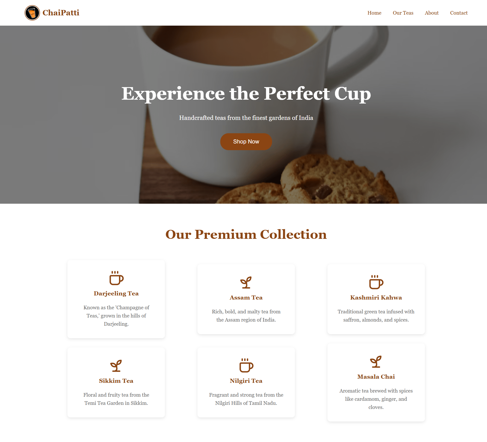

<a href="./">
  <h1 align="center">Week - 2</h1>
</a>

  Welcome to my Week Two Assignments repository! Here, you'll find solutions to CSS challenges. 

 

### [Chai Patti Pricing](./pricing-tables/pricing-table-1)

  

    
  

#

### [Chai Aur Fitness Pricing](./pricing-tables/pricing-table-2)

  

    
  

#

### [Landing Page-1](./landing-pages/landing-page-1)

  

    
  

#

### [Landing Page-2](./landing-pages/landing-page-2)

  

    
  

#

### [Landing Page-3](./landing-pages/landing-page-3)

  

    
  

